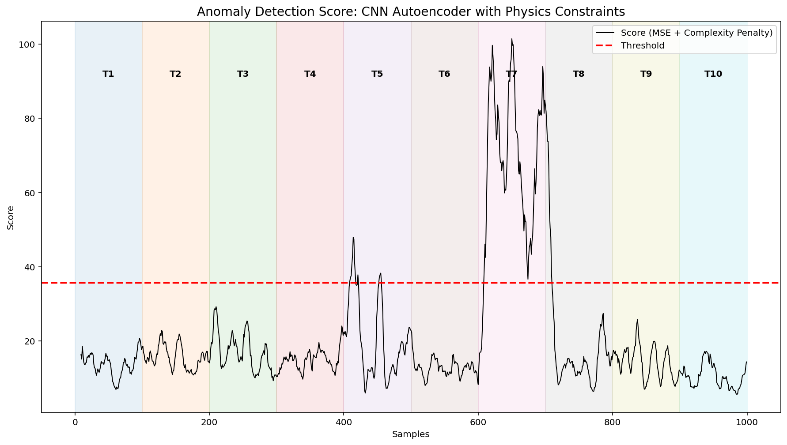
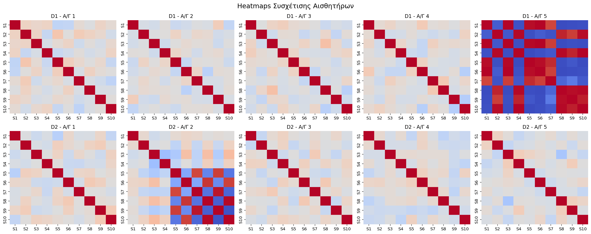
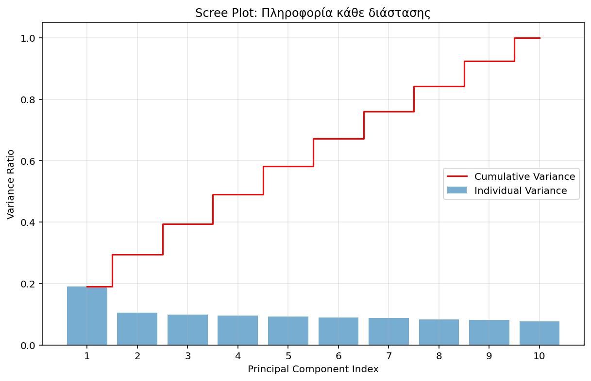

# Physics-Informed CNN Autoencoder for Wind Turbine Fault Detection

An unsupervised Deep Learning approach combining 1D-Convolutional Autoencoders (CNN-AE) with a custom **Physics-Informed Kinematic Penalty** to detect mechanical anomalies in wind turbine vibration data.

## 📌 Project Overview
Traditional data-driven anomaly detection often fails to capture the mechanical realities of dynamic systems. In this project, a baseline CNN Autoencoder was augmented with a **Physics-Informed Score**. 

By observing that specific faults exhibit unnatural signal stationarity or linearity, the model incorporates the first and second derivatives of the signal (velocity and acceleration) to penalize physically improbable states, boosting fault isolation accuracy.

## 🚀 Results & Visualizations

### 1. Anomaly Scoring & Dynamic Thresholding
The fused score (MSE + Kinematic Penalty) clearly isolates the localized faults, crossing the dynamic threshold precisely at the time of failure.

### 2. Fault Isolation (Heatmaps)
Post-inference heatmaps pinpoint exactly which turbine (e.g., Turbine 5 and Turbine 7) experienced the mechanical failure across the timeline.

### 3. Principal Component Analysis (Baseline)
Prior to deep learning, PCA was utilized to map the initial structural variance.

## 🛠️ Tech Stack
* **Deep Learning:** PyTorch (`torch.nn`, 1D-CNN)
* **Signal Processing:** SciPy, NumPy (Kinematic derivative approximations)
* **Data Visualization:** Matplotlib, Seaborn

## 💻 Repository Structure
* `data/`: Contains the `.mat` vibration datasets (D1 & D2).
* `src/model.py`: PyTorch implementation of the CNN Autoencoder.
* `src/physics_utils.py`: Logic for the custom kinematic complexity penalty.
* `src/main.py`: Data loading, preprocessing, and execution pipeline.
